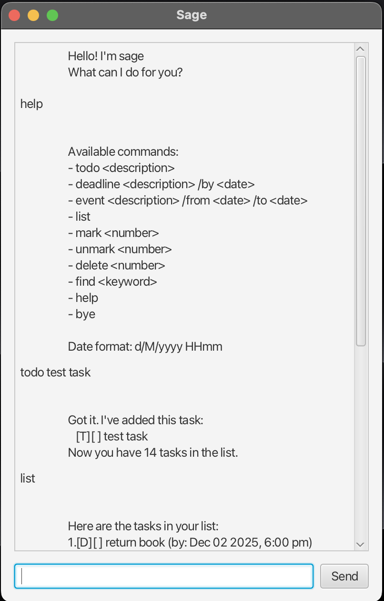

# Sage User Guide



**Sage** is a friendly task management chatbot that helps you organize your daily tasks, deadlines, and events. With an intuitive command-line interface and a modern JavaFX GUI, Sage makes task management simple and efficient.

## Features

- ✅ **Task Management**: Create todos, deadlines, and events
- 🔍 **Smart Search**: Find tasks by keywords
- 📅 **Date Handling**: Smart date parsing and reminders
- 💾 **Persistent Storage**: Automatic saving and loading
- 🎯 **User-Friendly**: Helpful error messages and command guidance

---

## Quick Start

1. **Launch Sage**: Run the application and you'll see the welcome message
2. **Type commands**: Use the input field to enter commands
3. **Get help**: Type `help` to see all available commands
4. **Exit**: Type `bye` to close the application

---

## Commands Reference

### **Task Creation**

#### Adding a Todo
Create a simple task without any time constraints.

**Format**: `todo <description>`

**Example**:
```
todo Buy groceries
```

**Expected Output**:
```
Got it. I've added this task:
   [T][ ] Buy groceries
Now you have 1 tasks in the list.
```

#### Adding a Deadline
Create a task with a specific due date and time.

**Format**: `deadline <description> /by <d/M/yyyy HHmm>`

**Example**:
```
deadline Submit assignment /by 25/12/2024 2359
```

**Expected Output**:
```
Got it. I've added this task:
   [D][ ] Submit assignment (by: Dec 25 2024, 11:59 PM)
Now you have 2 tasks in the list.
```

#### Adding an Event
Create a task that spans a specific time period.

**Format**: `event <description> /from <d/M/yyyy HHmm> /to <d/M/yyyy HHmm>`

**Example**:
```
event Team meeting /from 20/12/2024 1400 /to 20/12/2024 1600
```

**Expected Output**:
```
Got it. I've added this task:
   [E][ ] Team meeting (from: Dec 20 2024, 2:00 PM to: Dec 20 2024, 4:00 PM)
Now you have 3 tasks in the list.
```

### **Task Management**

#### Listing All Tasks
Display all your current tasks with their status.

**Format**: `list`

**Example**:
```
list
```

**Expected Output**:
```
Here are the tasks in your list:
1.[T][ ] Buy groceries
2.[D][ ] Submit assignment (by: Dec 25 2024, 11:59 PM)
3.[E][ ] Team meeting (from: Dec 20 2024, 2:00 PM to: Dec 20 2024, 4:00 PM)
```

#### Marking Tasks as Done
Mark a completed task with an 'X'.

**Format**: `mark <task number>`

**Example**:
```
mark 1
```

**Expected Output**:
```
Nice! I've marked this task as done:
   [T][X] Buy groceries
```

#### Unmarking Tasks
Remove the completion mark from a task.

**Format**: `unmark <task number>`

**Example**:
```
unmark 1
```

**Expected Output**:
```
OK, I've marked this task as not done yet:
   [T][ ] Buy groceries
```

#### Deleting Tasks
Permanently remove a task from your list.

**Format**: `delete <task number>`

**Example**:
```
delete 2
```

**Expected Output**:
```
Noted. I've removed this task:
   [D][ ] Submit assignment (by: Dec 25 2024, 11:59 PM)
Now you have 2 tasks in the list.
```

### **Search and Discovery**

#### Finding Tasks
Search for tasks containing specific keywords.

**Format**: `find <keyword>`

**Example**:
```
find meeting
```

**Expected Output**:
```
Here are the matching tasks in your list:
 1.[E][ ] Team meeting (from: Dec 20 2024, 2:00 PM to: Dec 20 2024, 4:00 PM)
```

### **Help and Navigation**

#### Getting Help
Display all available commands and their usage.

**Format**: `help`

**Example**:
```
help
```

**Expected Output**:
```
Available commands:
- todo <description>
- deadline <description> /by <date>
- event <description> /from <date> /to <date>
- list
- mark <number>
- unmark <number>
- delete <number>
- find <keyword>
- help
- bye

Date format: d/M/yyyy HHmm
```

#### Exiting the Application
Close Sage and save your tasks.

**Format**: `bye`

**Example**:
```
bye
```

**Expected Output**:
```
Bye. Hope to see you again soon!
```

---

## Date Format

Sage uses the following date format: **`d/M/yyyy HHmm`**

### Examples:
- `2/12/2024 1800` → December 2, 2024 at 6:00 PM
- `25/1/2025 0900` → January 25, 2025 at 9:00 AM
- `31/12/2024 2359` → December 31, 2024 at 11:59 PM

### Important Notes:
- Use **24-hour time format** (0000-2359)
- **Day and month** can be single digit (2/1/2024)
- **Year** must be 4 digits (2024, not 24)
- **No spaces** between date components except before time

---

## Task Status Icons

| Icon | Meaning |
|------|---------|
| `[T]` | Todo task |
| `[D]` | Deadline task |
| `[E]` | Event task |
| `[ ]` | Not completed |
| `[X]` | Completed |

---

## Smart Features

### **Upcoming Deadlines Reminder**
Sage automatically notifies you of deadlines due within the next 24 hours when you start the application.

### **Input Validation**
Sage provides helpful error messages for:
- Invalid command formats
- Missing required parameters
- Incorrect date formats
- Non-existent task numbers

### **Auto-Save**
Your tasks are automatically saved after every command, so you never lose your data.

---

## Common Error Messages

| Error | Cause | Solution |
|-------|--------|----------|
| "Please specify the task number to mark" | Empty task number | Provide a valid task number (e.g., `mark 1`) |
| "Please enter a valid task number" | Non-numeric input | Use numbers only (e.g., `mark 2`, not `mark abc`) |
| "Invalid date format" | Wrong date format | Use `d/M/yyyy HHmm` format |
| "I'm sorry, but I don't know what that means" | Unknown command | Type `help` to see available commands |

---

## Tips for Effective Use

1. **Use descriptive task names**: Instead of "homework", use "Complete CS2103T assignment"
2. **Set realistic deadlines**: Give yourself enough time to complete tasks
3. **Regular reviews**: Use `list` frequently to stay on top of your tasks
4. **Search efficiently**: Use `find` with keywords to quickly locate specific tasks
5. **Mark completed tasks**: Use `mark` to track your progress and stay motivated

---

## Technical Information

- **Developed by**: Rahul Mallavarapu
- **Built with**: Java 17, JavaFX 17.0.1
- **Storage**: Local file system (`./data/sage.txt`)
- **Platform**: Cross-platform (Windows, macOS, Linux)

---

*Happy task managing with Sage! 🎯*